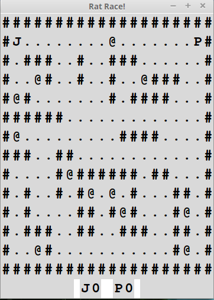

#RAT RACE GAME

This is the final project of Crafting Quality Code from University of Toronto through Coursera.

###REQUIREMENTS
1. Python3
2. tkinter python module
  * Included in Windows installer
  * `sudo apt-get install python3-tk `  for linux

###HOW TO USE
1. Go to the project and run `python3 rat_race.py` for linux , `python rat_race.py` for Windows
2. Choose the maze (There are 2 by default you can generate your own).
3. Play.

First player uses keys : w(up),a(left),s(down),d(right)

Second player uses keys : i(up),j(left),k(down),l(right)

You have to eat the sprouts (**@**) to win the game .

